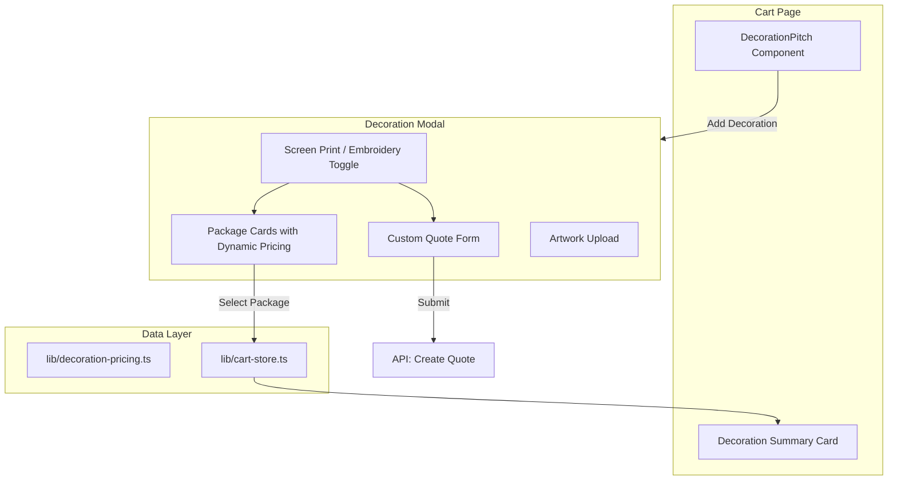

# Cart Decoration Modal

## Overview

Replace the current "Get Custom Quote" links in the cart with an in-cart modal that allows users to:

1. Select decoration type (Screen Print or Embroidery)
2. Choose from pre-defined packages with real-time pricing based on their cart quantity
3. Request a custom quote for complex jobs (with cart items pre-filled)
4. Optionally upload artwork

The goal is to reduce friction by keeping users on the cart page while providing transparent, quantity-aware pricing.

---

## Architecture



---

## Package Structure

### Screen Printing Packages

| Package | Description | Pricing Source |

|---------|-------------|----------------|

| Simple Logo | 1 location (front or left chest), 1-2 colors | `screenPrintPricing[tier][1]` |

| Front + Back | 2 locations, 1-2 colors each | `screenPrintPricing[tier][1] * 2` |

| Custom | Complex designs, 3+ colors, special inks | Opens quote form |

### Embroidery Packages

| Package | Description | Pricing Source |

|---------|-------------|----------------|

| Left Chest | 1 location, up to 5,000 stitches | `embroideryPricing[tier][1]` (5k stitches) |

| Cap Front | 1 location, up to 5,000 stitches | `embroideryPricing[tier][1]` |

| Custom | Multiple locations, large designs | Opens quote form |

Pricing tiers pulled from existing data in [components/tools/PricingCalculator.tsx](components/tools/PricingCalculator.tsx) lines 11-51.

---

## Files to Create

### 1. `lib/decoration-pricing.ts`

- Export pricing constants (import from PricingCalculator or define centrally)
- Export package definitions with pricing logic
- Export helper functions: `getDecorationPrice(packageId, quantity)`, `getQuantityTier(quantity)`

### 2. `components/cart/DecorationModal.tsx`

- Modal component with decoration type toggle
- Package cards showing dynamic pricing based on cart quantity
- Custom quote form with pre-filled cart items
- Artwork upload zone (optional, accepts all file types)
- "Add to Order" / "Request Quote" actions

---

## Files to Modify

### 1. `lib/cart-store.ts`

Add decoration state:

```typescript
interface DecorationSelection {
  type: 'screen-print' | 'embroidery';
  packageId: string;
  packageName: string;
  pricePerPiece: number;
  totalPrice: number;
  artworkFile?: string; // filename or URL
}

// Add to store:
decoration: DecorationSelection | null;
setDecoration: (decoration: DecorationSelection | null) => void;
clearDecoration: () => void;
```

### 2. `components/cart/DecorationPitch.tsx`

- Replace "Get Custom Quote" / "Add Screen Printing" links with "Add Decoration" button
- Button opens DecorationModal
- Keep the contextual messaging (tier-based pitch)

### 3. `app/cart/page.tsx`

- Import and render DecorationModal (controlled by state)
- Add DecorationSummaryCard below products table when decoration is selected
- Include decoration in order totals

### 4. `app/checkout/CheckoutContent.tsx`

- Display decoration selection in order summary
- Include decoration cost in totals

### 5. `app/checkout/OrderSummary.tsx`

- Add decoration line item display

---

## Custom Quote Flow

When user selects "Custom" package:

1. Modal switches to quote form view
2. Form shows:

   - **Cart items summary** (read-only, pre-filled from cart)
   - **Decoration type** (pre-selected based on toggle)
   - **Description textarea** - "Tell us what you need"
   - **Artwork upload** (optional)
   - **Contact info** (email required, phone optional)

3. Submit creates quote request via API
4. User sees confirmation with "We'll respond within 24 hours"

This keeps the user on the cart page and pre-fills their items, removing the friction of navigating to `/contact` and re-entering information.

---

## Artwork Handling

- Accept all file types (user confirmed)
- Optional upload with "Can add later" messaging
- Store in Supabase storage or send via email attachment
- Display filename in cart decoration summary when uploaded

---

## Cart Display

When decoration is selected, show a summary card below products:

```
+--------------------------------------------------+
| [Paint icon] Screen Printing - Simple Logo       |
| 150 pieces x $2.45/pc = $367.50                  |
| Artwork: company-logo.png                        |
|                              [Edit]  [Remove]    |
+--------------------------------------------------+
```

Single card, not one per product. Clean and scannable.

---

## Pricing Display in Modal

Package cards show the user's actual rate based on cart quantity:

```
+----------------------------------+
| Simple Logo              $2.45/pc |
| 1 location, 1-2 colors           |
| Est. total: $367.50 (150 pcs)    |
|                        [Select]  |
+----------------------------------+
```

Include "almost there" nudge if close to next price break:

- "Add 25 more pieces to save $0.50/piece"

---

## Separate Task (Not Part of This Plan)

The discontinued `(disc)` pricing bug in ProductDetailClient.tsx should be fixed in a separate PR to keep scope clean.