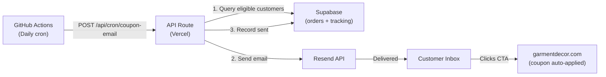

# Coupon Email Marketing Campaign — Automated 30-Day Re-Engagement

## Architecture Overview




## How It Works

1. A **GitHub Actions cron** runs daily (e.g., 7 AM PT / 2 PM UTC)
2. It calls `POST /api/cron/coupon-email` with an API key
3. The API route queries for customers whose **first paid order** was exactly 28-32 days ago (3-day window to handle timing drift) and who have **not already received** the campaign email
4. For each eligible customer, it sends the email via Resend with the **shared coupon code** and records the send in a tracking table
5. Each customer receives the email **only once ever**, regardless of how many orders they place

---

## What Needs to Be Built

### 1. Database: Campaign Send Tracking Table

New migration `supabase/migrations/021_coupon_email_campaign.sql`:

```sql
CREATE TABLE IF NOT EXISTS coupon_email_sends (
  id UUID PRIMARY KEY DEFAULT gen_random_uuid(),
  customer_email TEXT NOT NULL,
  customer_name TEXT,
  order_id UUID REFERENCES orders(id),
  order_number TEXT,
  coupon_code TEXT NOT NULL,
  campaign TEXT NOT NULL DEFAULT '30day_retention',
  sent_at TIMESTAMPTZ NOT NULL DEFAULT NOW(),
  resend_id TEXT,
  UNIQUE(customer_email, campaign)
);
```

The **UNIQUE constraint on (customer_email, campaign)** enforces the "only once ever" rule at the database level — any duplicate insert will be rejected. This is safer than application-level checks alone.

### 2. API Route: `/api/cron/coupon-email`

New file at `app/api/cron/coupon-email/route.ts`.

**Eligibility query logic** (pseudocode):

```sql
SELECT DISTINCT ON (o.customer_email)
  o.customer_email, o.customer_name, o.id, o.order_number, o.paid_at
FROM orders o
WHERE o.payment_status = 'paid'
  AND o.paid_at BETWEEN (now() - interval '32 days') AND (now() - interval '28 days')
  AND o.customer_email NOT IN (
    SELECT customer_email FROM coupon_email_sends WHERE campaign = '30day_retention'
  )
ORDER BY o.customer_email, o.paid_at ASC
LIMIT 50;
```

Key design decisions:

- **28-32 day window** instead of exactly 30 days — handles weekends, cron timing drift, and prevents missed customers
- **LIMIT 50** per run — prevents Resend rate limit issues and Vercel function timeouts; the daily cron will catch any overflow the next day
- **API key auth** — same pattern as existing `/api/sync` route, using `x-api-key` header
- `**paid_at`** timestamp (not `created_at`) — triggers 30 days after actual payment, not order creation

**Processing loop** for each eligible customer:

1. Send email via Resend with the shared coupon code
2. INSERT into `coupon_email_sends` with the Resend message ID
3. If the insert fails (UNIQUE violation), skip — customer already received it
4. Log success/failure for monitoring

### 3. Email Template: `lib/emails/coupon-campaign.tsx`

A new email template following the existing pattern in [lib/emails/](lib/emails/) — using the shared design system from [lib/emails/components.tsx](lib/emails/components.tsx).

**Email content (best practices):**

- **Subject line**: "A thank-you from Garment Decor — here's {discount} off your next order"
- **Preheader**: "Use code {CODE} at checkout. Expires in 14 days."
- **Body structure**:
  - Personalized greeting: "Hi {firstName},"
  - Thank-you message referencing their order
  - Coupon code in a prominent, copy-friendly box
  - Clear expiration date (creates urgency)
  - CTA button: "Shop Now" linking to `/catalog?utm_source=email&utm_medium=retention&utm_campaign=30day_coupon`
  - Brief mention of popular categories or new arrivals
  - Unsubscribe footer (CAN-SPAM compliance)
- **Both HTML and plain text** versions (matching existing pattern: `generateCouponCampaignHtml()` + `generateCouponCampaignText()`)

### 4. GitHub Actions Workflow: `.github/workflows/coupon-email-campaign.yml`

A new workflow following the existing pattern from `.github/workflows/sync-inventory.yml`:

```yaml
name: 30-Day Coupon Email Campaign
on:
  schedule:
    - cron: '0 14 * * *'  # 7 AM PT daily
  workflow_dispatch: {}     # Manual trigger for testing
```

Calls `POST /api/cron/coupon-email` with the API key from GitHub Secrets. Simple single-step workflow (unlike sync which needs batching).

### 5. Coupon Setup (Manual, One-Time)

Before launching, create the shared coupon via the existing admin UI at `/admin/coupons/new`:

- **Code**: e.g., `COMEBACK10` or `THANKYOU15`
- **Type**: `percent_cart` (percentage discount)
- **Amount**: Your chosen discount (e.g., 10-15%)
- **Min cart amount**: Optional (e.g., $100 minimum)
- **Usage limit per customer**: `1` (prevents double-use)
- **Expiration**: Set far in the future (the email copy communicates urgency; the coupon itself stays active for the ongoing campaign)

The coupon code is stored in the API route as a config constant (or env var `RETENTION_COUPON_CODE`), NOT hardcoded in the template.

---

## Email Marketing Best Practices Applied

- **Timing**: 30 days post-purchase is the sweet spot — recent enough to remember the brand, long enough that they may need to reorder
- **Single send**: One email per customer ever — no spam, protects sender reputation
- **Personalization**: Greeting by first name, reference to their order
- **Urgency**: "Expires in 14 days" in the email copy (even if the coupon itself stays active)
- **CAN-SPAM compliance**: Unsubscribe link, physical address in footer (already in shared email footer)
- **UTM tracking**: All links tagged with `utm_source=email&utm_medium=retention&utm_campaign=30day_coupon` for GA4 attribution
- **Plain text fallback**: Both HTML and text versions for deliverability
- **Rate limiting**: Max 50 emails per cron run prevents Resend throttling
- **Idempotent**: UNIQUE constraint + insert-or-skip pattern means re-running the cron is safe

---

## Files to Create/Modify


| Action     | File                                                |
| ---------- | --------------------------------------------------- |
| **Create** | `supabase/migrations/021_coupon_email_campaign.sql` |
| **Create** | `app/api/cron/coupon-email/route.ts`                |
| **Create** | `lib/emails/coupon-campaign.tsx`                    |
| **Create** | `.github/workflows/coupon-email-campaign.yml`       |


No existing files need to be modified. This is entirely additive.

---

## Testing Strategy

1. **Local**: Create a test order in Supabase with `paid_at` set to 30 days ago, then manually call the API route
2. **Staging**: Use `workflow_dispatch` to manually trigger the GitHub Action
3. **Resend test mode**: Send to your own email first by inserting a test row
4. **Monitor**: Check `coupon_email_sends` table for send records and `resend_id` for delivery status

